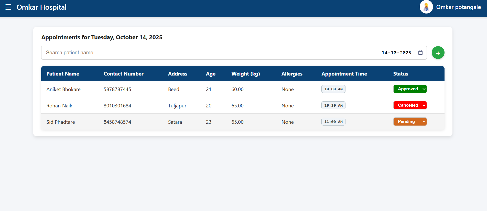
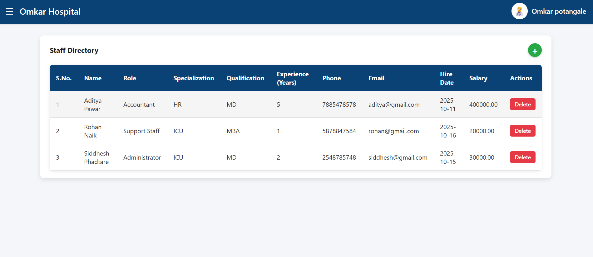
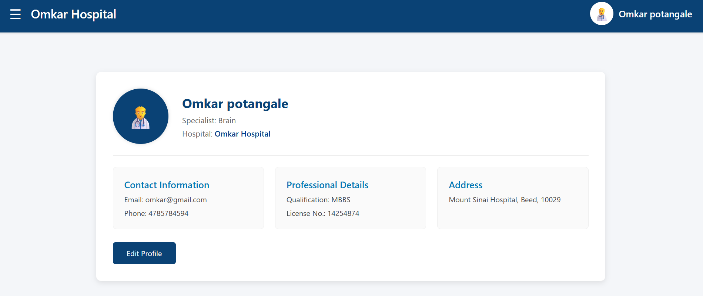
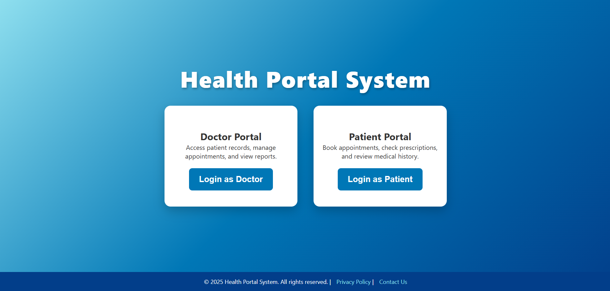
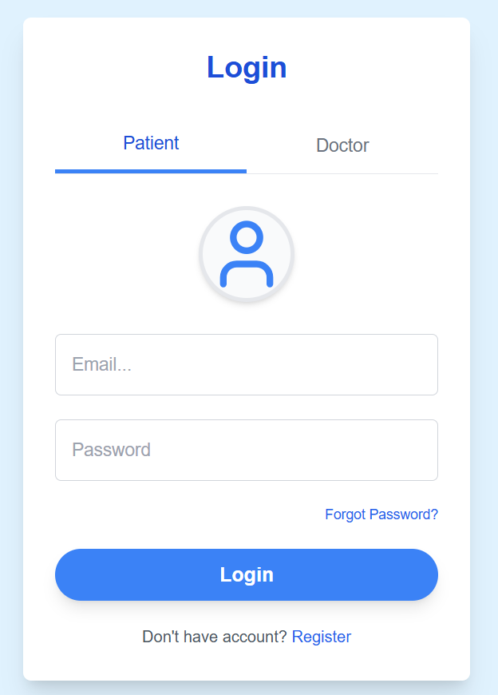
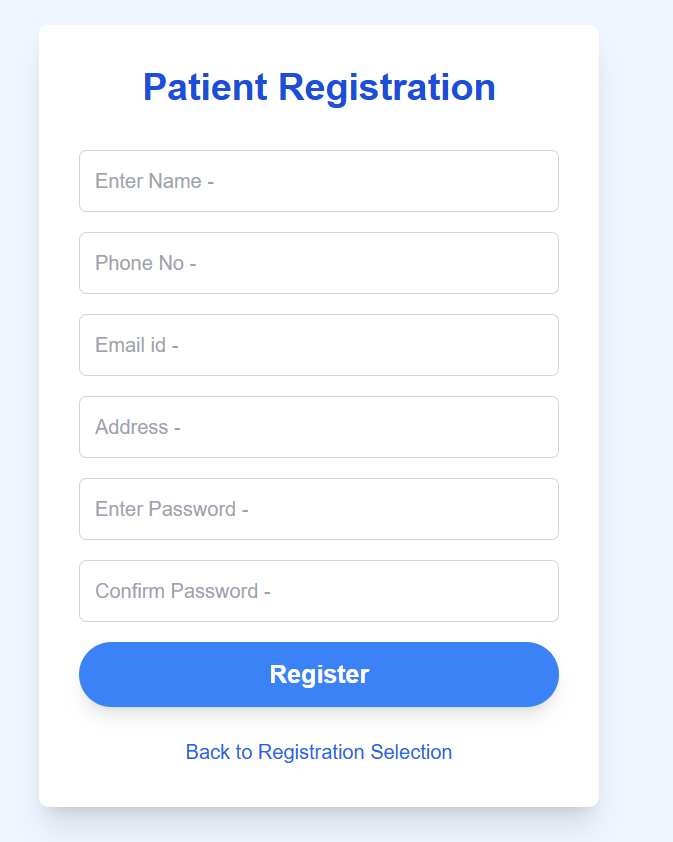
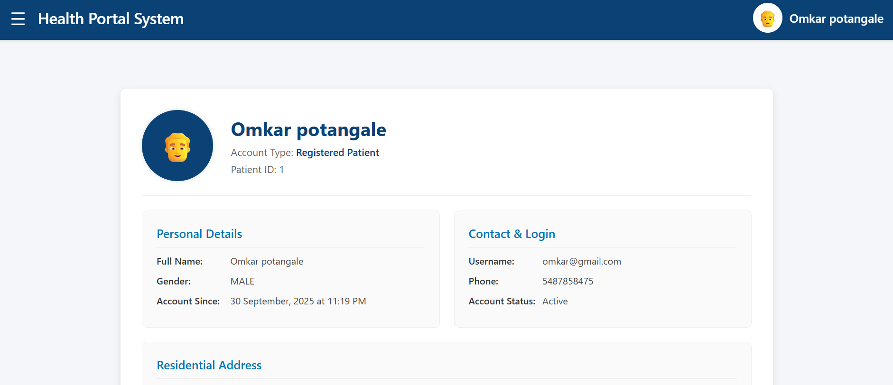
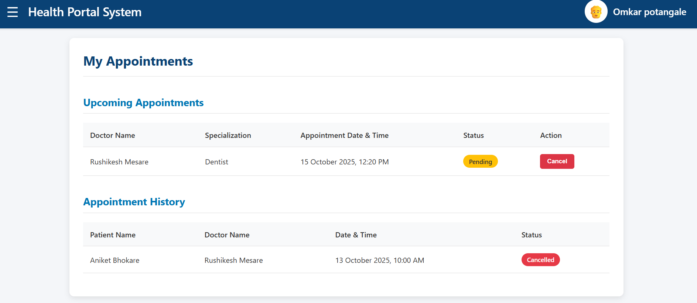

# Hospital Management System 🏥
> A digital solution to replace manual hospital record-keeping and streamline patient-doctor workflows.

---

## 📑 Table of Contents
* [Overview](#-overview)
* [Key Features](#-key-features)
* [System Architecture](#-how-it-works)
* [Project Preview](#-project-preview)
* [Getting Started](#-how-to-run-it-locally)

---

## 🚀 Overview
Managing a hospital with paper records is slow and prone to errors. This application digitizes the entire process. It provides a **Patient Portal** to book appointments and a **Doctor/Admin Portal** to manage daily schedules, staff, and medical records in real-time.

---

## 💡 Key Features
* **👩‍⚕️ For Doctors:** Manage daily appointments, approve/cancel requests, and update professional profiles.
* **👨‍ Patient Focus:** Search for doctors, book slots, and track appointment history easily.
* **🏢 Admin Control:** Manage staff directories, roles, and salary data from one central hub.
* **🔒 Secure Access:** Role-based logins ensure doctors and patients only see relevant data.

---

## 🏗 How it works
* **UI Layer:** HTML/JSP pages for a clean, user-friendly experience.
* **Logic Layer:** Java Servlets and Scriptlets process logins and bookings.
* **Database Layer:** JDBC connects the app to MySQL, ensuring all records are safely saved.

---

## 📸 Project Preview

### **Doctor & Admin Operations**
| Dashboard | Staff Directory | Appointments | Profile |
| :---: | :---: | :---: | :---: |
|  |  |  |  |

### **Patient Experience**
| Home | Login | Register | Dashboard | My Appointments |
| :---: | :---: | :---: | :---: | :---: |
|  |  |  |  |  |

---

## 🚀 How to Run It Locally
1. **Clone:** `git clone https://github.com/rohannaik06/hospital-management-system.git`
2. **Database:** Create a database named `HMS` in MySQL and run the SQL schema.
3. **Configure:** Update your DB credentials in the JSP files.
4. **Deploy:** Import to your IDE and run on Apache Tomcat.
5. **Launch:** Access `http://localhost:8080/HMS1/`

---

## 👨‍💻 Developed By
**Rohan Naik** | [LinkedIn](https://www.linkedin.com/in/rohannaik06) | [Email](mailto:rohannaik1426@gmail.com)
*Built as an academic project for Java Web Technologies.*
